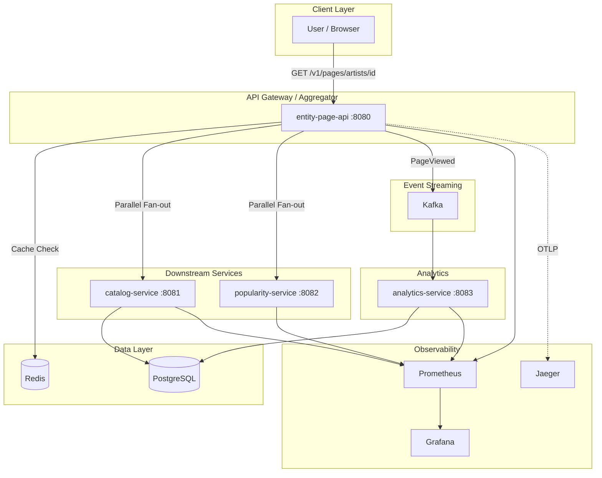
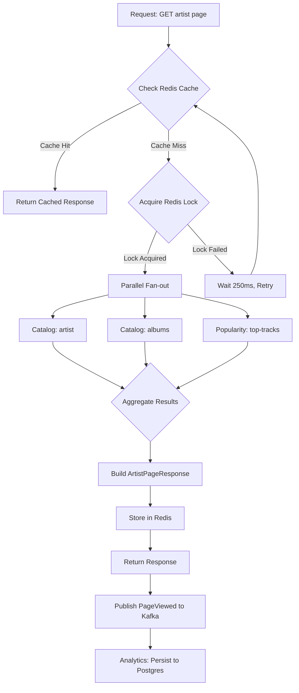
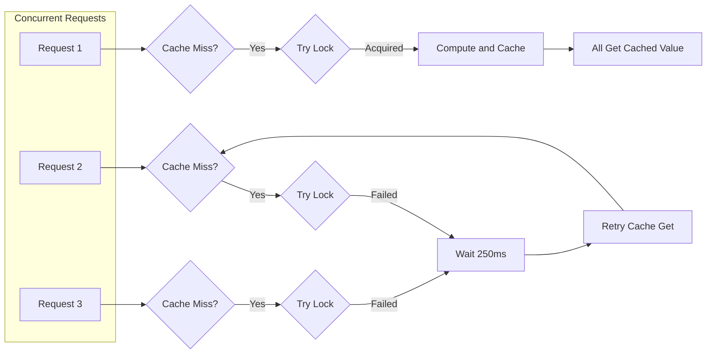

# Music Entity Aggregation Service

A production-style backend portfolio project inspired by **Spotify's Entity Page Backend** ("Meadow" team). This system powers Artist/Album/Playlist pages by aggregating multiple internal services with low latency, caching, resilience, and observability.

---

## Table of Contents

- [Overview](#overview)
- [Architecture](#architecture)
- [Request Flow](#request-flow)
- [Services](#services)
- [API Reference](#api-reference)
- [Data Models](#data-models)
- [Caching Strategy](#caching-strategy)
- [Resilience & Fault Tolerance](#resilience--fault-tolerance)
- [Observability](#observability)
- [Tech Stack](#tech-stack)
- [Getting Started](#getting-started)
- [Configuration](#configuration)
- [Testing](#testing)
- [Design Decisions & Tradeoffs](#design-decisions--tradeoffs)

---

## Overview

This project demonstrates a **microservices architecture** for building high-performance entity pages (similar to Spotify's artist/album pages). Key capabilities:

- **Parallel fan-out** to downstream services (catalog, popularity) with reactive streams
- **Redis caching** with stampede protection and TTL jitter
- **Resilience4j** for timeouts, circuit breakers, and fallbacks
- **Async analytics** via Kafka (fire-and-forget PageViewed events)
- **Full observability** with Prometheus, Grafana, and Jaeger tracing

---

## Architecture

### High-Level System Diagram



### Request Flow (Artist Page)



### Cache Stampede Protection



---

## Services

| Service | Port | Responsibility |
|---------|------|----------------|
| **entity-page-api** | 8080 | Main aggregator. Orchestrates cache, downstream calls, and event publishing. Reactive (WebFlux). |
| **catalog-service** | 8081 | Artist, album, and track metadata. Postgres + Flyway. |
| **popularity-service** | 8082 | Top tracks by artist. Deterministic in-memory data. |
| **analytics-service** | 8083 | Consumes Kafka `page-events`, persists to Postgres. Exposes query API. |

---

## API Reference

### entity-page-api

#### `GET /v1/pages/artists/{artistId}`

Returns an aggregated artist page.

**Request Headers**

| Header | Required | Default | Description |
|--------|----------|---------|-------------|
| `X-User-Id` | No | — | Used for experiment bucketing |
| `X-Region` | No | `SE` | Region (affects cache key) |
| `Accept-Language` | No | `en` | Language (affects cache key) |
| `X-Request-Id` | No | auto-generated | Request/trace ID |

**Response (200 OK)**

```json
{
  "pageType": "ARTIST",
  "entityId": "a_1",
  "displayName": "Daft Punk",
  "heroImage": { "url": "https://...", "w": 640, "h": 640 },
  "sections": [
    { "type": "TOP_TRACKS", "items": [{ "trackId": "t_1", "title": "Get Lucky", "durationMs": 369000 }] },
    { "type": "ALBUMS", "items": [{ "albumId": "al_1", "title": "Random Access Memories", "releaseDate": "2013-05-17" }] }
  ],
  "experiments": { "showRelatedArtists": "control" },
  "generatedAt": "2026-03-02T00:12:00Z",
  "traceId": "abc-123"
}
```

**Response (404 Not Found)** — Artist not found in catalog.

---

### catalog-service

| Endpoint | Description |
|----------|-------------|
| `GET /v1/artists/{artistId}` | Artist metadata |
| `GET /v1/artists/{artistId}/albums` | Artist albums |
| `GET /v1/tracks/{trackId}` | Track metadata |

---

### popularity-service

| Endpoint | Description |
|----------|-------------|
| `GET /v1/artists/{artistId}/top-tracks` | Top tracks by popularity |

---

### analytics-service

| Endpoint | Description |
|----------|-------------|
| `GET /v1/analytics/page-views?entityId=...&from=...&to=...` | Page view events for an entity |

**Query Parameters**

- `entityId` (required): Filter by entity ID
- `from` (optional): ISO-8601 start time (default: 24h ago)
- `to` (optional): ISO-8601 end time (default: now)

---

## Data Models

### Artist Page Response

| Field | Type | Description |
|-------|------|-------------|
| `pageType` | string | `"ARTIST"` |
| `entityId` | string | Artist ID |
| `displayName` | string | Artist name |
| `heroImage` | object | `{ url, w, h }` |
| `sections` | array | Page sections (TOP_TRACKS, ALBUMS, RELATED_ARTISTS) |
| `experiments` | object | `{ showRelatedArtists: "control" \| "variantA" }` |
| `generatedAt` | ISO-8601 | Response generation time |
| `traceId` | string | Request trace ID |

### PageViewed Event (Kafka)

| Field | Type | Description |
|-------|------|-------------|
| `eventType` | string | `"PageViewed"` |
| `pageType` | string | `"ARTIST"` |
| `entityId` | string | Artist ID |
| `userId` | string | From `X-User-Id` |
| `region` | string | From `X-Region` |
| `lang` | string | From `Accept-Language` |
| `latencyMs` | number | Response latency |
| `cacheHit` | boolean | Whether response came from cache |
| `timestamp` | ISO-8601 | Event time |
| `traceId` | string | Request trace ID |

---

## Caching Strategy

| Aspect | Implementation |
|--------|-----------------|
| **Cache Key** | `page:artist:{artistId}|{region}|{language}|{experimentBucket}` |
| **TTL** | 60s + random jitter 0–15s (reduces thundering herd) |
| **Stampede Protection** | Redis lock `page:lock:...` with `SET NX EX 3` |
| **Lock Retries** | Up to 12 × 250ms (~3s) before computing anyway |
| **Fallback** | If lock not acquired, wait and retry cache get (another request may have populated) |

---

## Resilience & Fault Tolerance

| Mechanism | Configuration | Behavior |
|-----------|---------------|----------|
| **Timeouts** | 80ms for downstream calls | WebClient connect/read timeout |
| **Circuit Breaker** | 50% failure rate, 10 sliding window | Opens after 5 failures in 10 calls |
| **Retries** | 2 attempts, 50ms wait | Per downstream call |
| **Fallbacks** | | |
| — Catalog 404 | — | Return 404 to client |
| — Catalog 5xx/timeout | — | Propagate error |
| — Popularity failure | — | Omit TOP_TRACKS section |
| — Albums failure | — | Return empty ALBUMS section |

---

## Observability

| Component | Purpose |
|-----------|---------|
| **Prometheus** | Scrapes `/actuator/prometheus` from all services |
| **Grafana** | Pre-provisioned dashboards (request rate, p95 latency, circuit breaker state) |
| **Jaeger** | Distributed tracing via OTLP (HTTP 4318) |
| **Structured Logs** | JSON logs with `requestId`, `traceId` |

**Infrastructure Ports**

| Service | Port | URL |
|---------|------|-----|
| Prometheus | 9090 | http://localhost:9090 |
| Grafana | 3000 | http://localhost:3000 (admin/admin) |
| Jaeger UI | 16686 | http://localhost:16686 |

---

## Tech Stack

| Layer | Technologies |
|-------|--------------|
| **Runtime** | Java 21, Spring Boot 3.3.x |
| **Build** | Maven |
| **API** | Spring WebFlux (reactive) for entity-page-api; Spring Web MVC for others |
| **Database** | PostgreSQL, Spring Data JPA, Flyway |
| **Cache** | Redis, Spring Data Redis Reactive |
| **Messaging** | Apache Kafka, Spring Kafka |
| **Resilience** | Resilience4j (circuit breaker, retry, time limiter) |
| **Observability** | Micrometer, Prometheus, OpenTelemetry, Jaeger |

---

## Getting Started

### Prerequisites

- Java 21
- Maven 3.9+
- Docker & Docker Compose

### 1. Start Infrastructure

```bash
docker compose -f infra/docker-compose.yml up -d
```

This starts: PostgreSQL, Redis, Kafka, Zookeeper, Prometheus, Grafana, Jaeger.

### 2. Build

```bash
mvn clean install -DskipTests
```

### 3. Run Services (4 terminals)

```bash
# Terminal 1: catalog-service (requires Postgres)
mvn -f services/catalog-service/pom.xml spring-boot:run

# Terminal 2: popularity-service
mvn -f services/popularity-service/pom.xml spring-boot:run

# Terminal 3: analytics-service (requires Postgres + Kafka)
mvn -f services/analytics-service/pom.xml spring-boot:run

# Terminal 4: entity-page-api (requires Redis, Kafka, catalog, popularity)
mvn -f services/entity-page-api/pom.xml spring-boot:run
```

### 4. Verify

```bash
# Artist page
curl -s http://localhost:8080/v1/pages/artists/a_1 | jq

# With headers
curl -s -H "X-User-Id: u_99" -H "X-Region: SE" -H "Accept-Language: en" \
  http://localhost:8080/v1/pages/artists/a_1 | jq
```

---

## Configuration

| Property | Default | Description |
|----------|---------|-------------|
| `services.catalog.url` | http://localhost:8081 | Catalog service base URL |
| `services.popularity.url` | http://localhost:8082 | Popularity service base URL |
| `spring.data.redis.host` | localhost | Redis host |
| `spring.data.redis.port` | 6379 | Redis port |
| `spring.kafka.bootstrap-servers` | localhost:9092 | Kafka brokers |
| `kafka.topics.page-events` | page-events | Kafka topic for PageViewed events |
| `management.otlp.tracing.endpoint` | http://localhost:4318/v1/traces | OTLP exporter for Jaeger |

---

## Testing

```bash
mvn -f services/entity-page-api/pom.xml test
```

**Integration tests** use:

- **Testcontainers** — Redis container
- **WireMock** — Stubs for catalog and popularity
- **Embedded Kafka** — For PageViewed events

**Coverage:** Health endpoint, cache hit/miss behavior, error handling for unknown artist.

---

## Project Structure

```
/
├── services/
│   ├── entity-page-api/    # Main aggregator
│   │   ├── controller/     # REST endpoints
│   │   ├── service/        # Cache, aggregation logic
│   │   ├── client/         # WebClient for catalog, popularity
│   │   ├── cache/          # Redis cache + stampede protection
│   │   ├── event/          # Kafka PageViewed producer
│   │   └── config/         # WebClient, Kafka, Resilience4j
│   ├── catalog-service/    # Artist/Album/Track metadata
│   ├── popularity-service/ # Top tracks
│   └── analytics-service/  # Kafka consumer, page_views storage
├── infra/
│   ├── docker-compose.yml
│   ├── prometheus/prometheus.yml
│   └── grafana/provisioning/
└── README.md
```

---

## Design Decisions & Tradeoffs

| Decision | Rationale |
|----------|-----------|
| **WebFlux over Web MVC** | Native reactive, non-blocking I/O for parallel fan-out. Mono/Flux compose well with Resilience4j reactor. |
| **Reactive streams vs virtual threads** | WebFlux uses reactive streams (Mono/Flux) for parallel fan-out. Virtual threads would require a different stack (e.g. Web MVC + blocking clients). |
| **Redis lock for stampede** | Simple, no extra infrastructure. Alternative: probabilistic early expiration (e.g. X% of requests refresh before TTL). |
| **Fire-and-forget Kafka** | PageViewed events don't affect response. Async send avoids blocking. Failures logged but not retried in request path. |
| **Circuit breaker on catalog** | Catalog 404s are not failures for the breaker—only 5xx/timeouts. Fallback: return 404 for unknown artist. |
| **Shared Postgres** | Catalog and analytics use separate schemas (`catalog`, `analytics`) in one DB for local dev simplicity. |

---

## License

MIT
